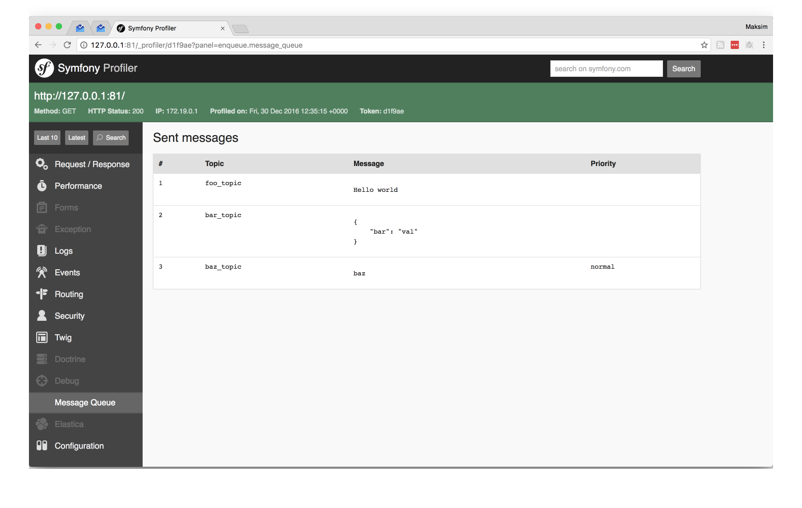
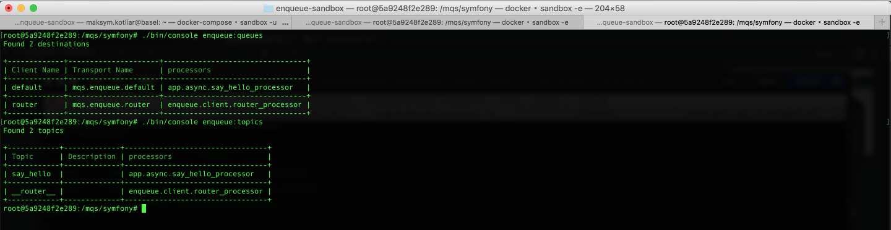
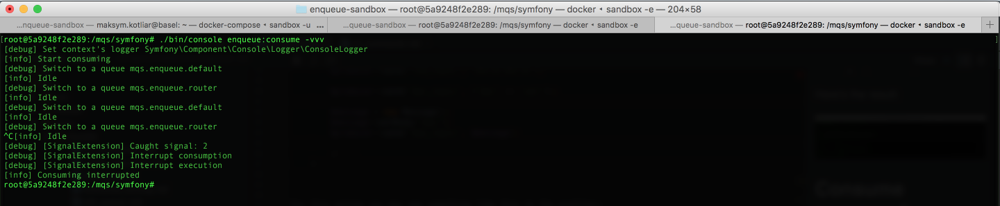



# Debugging

## Profiler

It may be useful to see what messages were sent during a http request.
The bundle provides a collector for Symfony [profiler](http://symfony.com/doc/current/profiler.html).
The extension collects all sent messages

To enable profiler

```yaml
# app/config/config_dev.yml

enqueue:
    default:
        client:
            traceable_producer: true
```

Now suppose you have this code in an action:

```php
<?php

use Symfony\Bundle\FrameworkBundle\Controller\Controller;
use Symfony\Component\HttpFoundation\Request;
use Enqueue\Client\Message;
use Enqueue\Client\ProducerInterface;

class DefaultController extends Controller
    /**
     * @Route("/", name="homepage")
     */
    public function indexAction(Request $request)
    {
        /** @var ProducerInterface $producer */
        $producer = $this->get('enqueue.producer');

        $producer->sendEvent('foo_topic', 'Hello world');

        $producer->sendEvent('bar_topic', ['bar' => 'val']);

        $message = new Message();
        $message->setBody('baz');
        $producer->sendEvent('baz_topic', $message);

        // ...
    }

```

For this action you may see something like this in the profiler:

 

## Queues and topics available

There are two console commands `./bin/console enqueue:queues` and `./bin/console enqueue:topics`.
They are here to help you to learn more about existing topics and queues.

Here's the result:



## Consume command verbosity

By default the commands `enqueue:consume` or `enqueue:transport:consume` does not output anything.
You can add `-vvv` to see more information.



[back to index](index.md)
