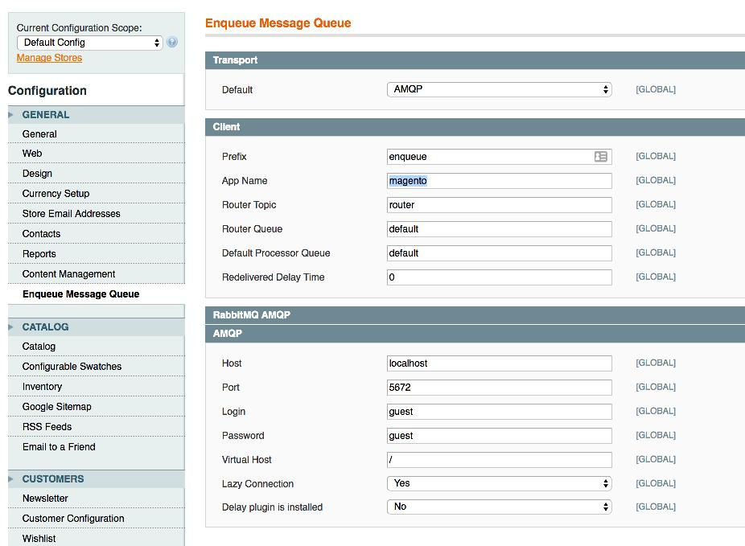



# Magento Enqueue. Quick tour

The module integrates [Enqueue Client](../client/quick_tour.md) with Magento1. You can send and consume messages to different message queues such as RabbitMQ, AMQP, STOMP, Amazon SQS, Kafka, Redis, Google PubSub, Gearman, Beanstalk, Google PubSub and others. Or integrate Magento2 app with other applications or service via [Message Bus](../client/message_bus.md).
There is [a module](../magento2/quick_tour.md) for Magento2 too.

## Installation

We use [composer](https://getcomposer.org/) and [cotya/magento-composer-installer](https://github.com/Cotya/magento-composer-installer) plugin to install [magento-enqueue](https://github.com/php-enqueue/magento-enqueue) extension.

To install libraries run the commands in the application root directory.

```bash
composer require "magento-hackathon/magento-composer-installer:~3.0"
composer require "enqueue/magento-enqueue:*@dev" "enqueue/amqp-ext"
```

_**Note**: You could use not only AMQP transport but any other [available](../transport)._

## Configuration

At this stage we have configure the Enqueue extension in Magento backend.
The config is here: `System -> Configuration -> Enqueue Message Queue`.
Here's the example of Amqp transport that connects to RabbitMQ broker on localhost:




## Publish Message

To send a message you have to take enqueue helper and call `send` method.

```php
<?php

Mage::helper('enqueue')->send('a_topic', 'aMessage');
```

## Message Consumption

I assume you have `acme` Magento module properly created, configured and registered.
To consume messages you have to define a processor class first:

```php
<?php
// app/code/local/Acme/Module/Helper/Async/Foo.php

use Interop\Queue\Context;
use Interop\Queue\Message;
use Interop\Queue\Processor;

class Acme_Module_Helper_Async_Foo implements Processor
{
    public function process(Message $message, Context $context)
    {
        // do job
        // $message->getBody() -> 'payload'

        return self::ACK;         // acknowledge message
        // return self::REJECT;   // reject message
        // return self::REQUEUE;  // requeue message
    }
}
```

than subscribe it to a topic or several topics:


```xml
<!-- app/etc/local.xml -->

<config>
  <default>
    <enqueue>
      <processors>
        <foo-processor>
          <topic>a_topic</topic>
          <helper>acme/async_foo</helper>
        </foo-processor>
      </processors>
    </enqueue>
  </default>
</config>
```

and run message consume command:

```bash
$ php shell/enqueue.php enqueue:consume -vvv --setup-broker
```

[back to index](../index.md)
